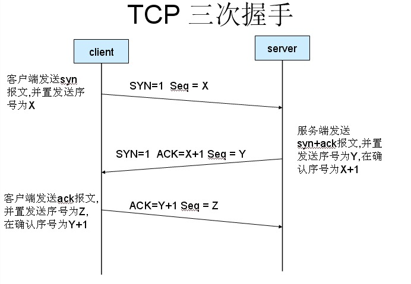
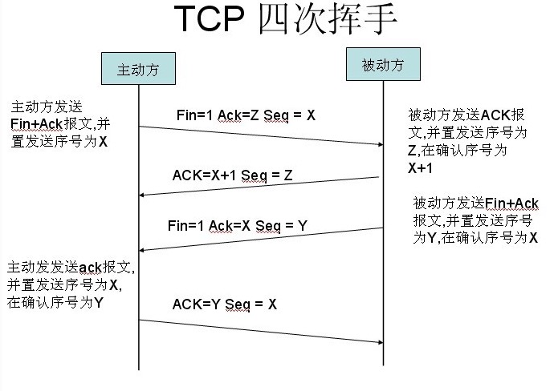
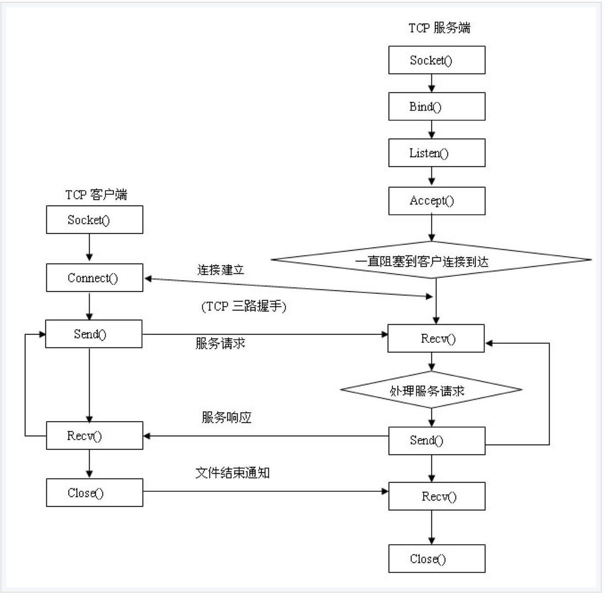
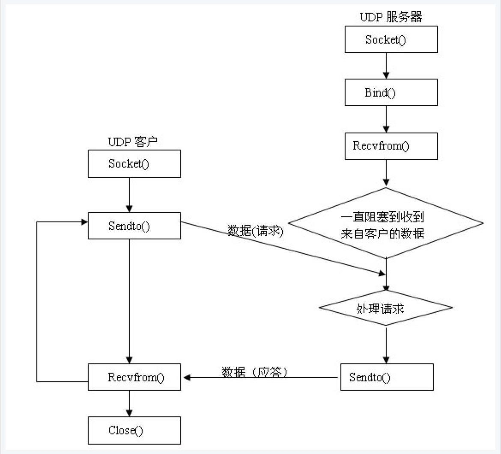

# Socket学习

##一、概念理解

1.**什么是Socket？**

  Socket又称为“套接字”，是系统提供的用于网络通信的方法，本质并不是一个协议，没有规定计算机怎么样传递消息，只是给程序员提供一个接口，使用这个接口提供的方法，发送和接收消息。

  Socket简化了程序员操作，知道对方的IP和端口号的情况下，就可以给对方发送消息，再有服务端来处理，因此需要服务端和客户端。

2.**Socket的通信过程**

  每一个应用或者服务都有一个端口，因此需要包含以下的步骤：

* 服务端利用Socket监听端口；

* 客户端发起连接；

* 服务端返回信息，建立连接，开始通信；

* 客户端，服务端断开连接；


##二、各协议的区别

  OSI模型把网络通信分成7层，由低向高分别是：物理层，数据链路层，网络层，传输层，会话层，表示层和应用层。

  我们常用的HTTP协议是对应应用层，TCP协议对应传输层，IP协议对应网络层，HTTP协议是基于TCP连接。

  TCP/IP是传输层协议，主要解决数据如何在网络中传输；而HTTP是应用层协议，主要解决如何包装数据。

  在传输数据时候可以只是用TCP/IP，但是这样没有应用层，无法识别传输的数据类容，这样是没有意义的，如果想使传输的数据有意义，则必须使用应用层协议，HTTP就是一种，WEB使用它，封装HTTP文本信息，然后使用TCP/IP协议传输到网络上
  
  Socket实际上就是对TCP/IP协议的封装，本身并不是协议，而是调用一个接口（API），通过Socket，我们才能使用TCP/IP协议；


###HTTP和Socket连接的区别

1.**TCP连接**

Socket本身就是对TCP的封装，就要先明白TCP连接：

建立一次TCP连接需要进行"三次握手"：





首先了解一下几个标志，SYN（synchronous），同步标志，ACK (Acknowledgement），即确认标志，seq应该是Sequence Number，序列号的意思，另外还有四次握手的fin，应该是final，表示结束标志。

简单的用英语来表示就是：

客户端：hi,how are you？

服务端：fine，thank you,and you？

客户端：i am fine too.

1. 客户端发送一个TCP的SYN标志位置1的包指明客户打算连接的服务器的端口，以及初始序号X,保存在包头的序列号(Sequence Number)字段里。
2. 服务器发回确认包(ACK)应答。即SYN标志位和ACK标志位均为1同时，将确认序号(Acknowledgement Number)设置为客户的序列号加1以，即X+1。
3. 客户端再次发送确认包(ACK) SYN标志位为0，ACK标志位为1。并且把服务器发来ACK的序号字段+1，放在确定字段中发送给对方.并且在数据段放写序列号的+1。

只有进行完三次握手后，才能正式传输数据，理想状态下只要建立起连接，在通信双方主动关闭连接之前，TCP连接将会一直保持下去。三次握手能够确保对面已经收到自己的同步序列号，这样就可以保证后续数据包的丢失可以被察觉，这也是TCP流式传输的基础。 


断开TCP连接需要发送4个包，客户端和服务端都可以发起这个请求，在Socket编程中任何一方执行close（）操作就会产生"四次握手"：




**关闭为什么是4次，而连接是3次，是因为当服务端收到客户端的SYN连接请求报文后，可以直接发送SYN+ACK报文，ACK用来回应，SYN用来同步。但是当关闭连接的情况下，接收端收到FIN报文时候，很可能不会立即关闭，所以先发送一个ACK报文告诉发送端我收到了，只有等接收端报文全部发送完了，才能发送FIN报文。**


2.**HTTP连接**

HTPP协议即超文本传送协议，是建立在TCP协议之上的一种。客户端每次发送的请求都要服务端回送响应，请求结束后，会自动释放连接。

3.**Socekt连接**

概念：Socket是通信的基石，是支持TCP/IP协议的基本操作单元，包含5种信息：连接使用的协议，本机主机IP地址，本地进程的端口号，远程主机IP地址，远程进程的协议端口。

应用层通过传输层进行数据传输时候，可能会遇到同一个TCP协议端口传输好几种数据，可以通过socket来区分不同应用程序或者网络连接。

建立Socket连接的步骤
1. 至少需要1对，一个作用于客户端，一个在服务端；
2. 连接分为三个步骤：服务器监听，客户端请求，连接确认；
3. 服务器监听：并不对应具体的客户端socket，而是处于等待连接状态，实时监听网络状态，等待客户端连接；
4. 客户端请求：客户端的套接字向服务端套接字发起连接请求，因此需要知道服务端的套接字的地址和端口号，而且需要描述他要连接的服务器的套接字；
5. 连接确认：当服务端套接字监听到或者接收到客户端的套接字的连接请求，就响应客户端的套接字，建立一个新的连接，把服务端的套接字的描述发给客户端，一旦确认，双方就正式建立连接。而且服务端的套接字仍在监听状态，继续接受其他客户端的套接字。

**Socket HTTP TCP区别**

Socket连接可以指定传输层协议，可以是TCP或者UDP，当时TCP协议时候就是一个TCP连接。而HTTP连接是请求->响应的方式，在请求时候需要先建立连接，然后客户端向服务器发出请求之后，服务器才能回复数据。而Socket一旦建立连接，服务器可以主动将数据传输给客户端；而HTTP则需要客户端先向服务器发送请求之后才能将数据返回给客户端。但实际上Socket建立之后因为种种原因，会导致断开连接，其中一个原因就是防火墙会断开长时间处于非活跃状态的连接，因此需要轮询高速网络，这个连接是活跃的。


## 三、在iOS里面的使用

iOS提供了Socket网络编程接口CFSocket，tcp和udp的socket是有区别的。

**基于TCP的Socket：**
> 


**基于UDP的Socket**

> 

常用的Socket类型分为两种，流式Socket（SOCKET_STREAM）和数据报式（SOCKET_DGRAM）,流式针对于面向TCP连接的应用，而数据报式是一种无连接的Socket，对应于无连接的UDP服务应用。

iOS官方给出的使用时CFSocket，它是基于BSD Socket进行抽象和封装，CFSocket 中包含了少数开销，它几乎可以提供 BSD sockets 所具有的一切功能，并且把 socket 集成进一个“运行循环”当中。CFSocket 并不仅仅限于基于流的 sockets (比如 TCP)，它可以处理任何类型的 socket。

你可以利用 CFSocketCreate 功能从头开始创建一个 CFSocket 对象，或者利用 CFSocketCreateWithNative 函数从 BSD socket 创建。然后，需要利用函数 CFSocketCreateRunLoopSource 创建一个“运行循环”源，并利用函数CFRunLoopAddSource 把它加入一个“运行循环”。这样不论 CFSocket 对象是否接收到信息， CFSocket 回调函数都可以运行。

---

好了，废话少说，进入正题。

###客户端

客户端创建Socket相对简单不少，步骤如下：

0.(可选)创建CFSocketContext->用来关联Socket上下文信息

``` obj-c
  /*
  struct CFSocketContext
  {
      CFIndex version; 版本号，必须为0
      void *info; 一个指向任意程序定义数据的指针，可以在CFScocket对象刚创建的时候与之关联，被传递给所有在上下文中回调；
      CFAllocatorRetainCallBack retain; info指针中的retain回调，可以为NULL
      CFAllocatorReleaseCallBack release; info指针中的release的回调，可以为NULL
      CFAllocatorCopyDescriptionCallBack copyDescription; info指针中的回调描述，可以为NULL
  };
  typedef struct CFSocketContext CFSocketContext;
  */
 
实现代码：
  //这里把self作为数据指针传过去，这样在回调的时候就能拿到当前的VC
  CFSocketContext sockContext = {0,(__bridge void *)(self),NULL,NULL,NULL};

```

1.创建CFSocket对象
```obj-c
     CFSocketRef SocketRef = CFSocketCreate
    (
      //内存分配类型，一般为默认的Allocator->kCFAllocatorDefault
     <#CFAllocatorRef allocator#>,
      //协议族,一般为Ipv4:PF_INET,(Ipv6,PF_INET6)
     <#SInt32 protocolFamily#>,
     //套接字类型，TCP用流式—>SOCK_STREAM，UDP用报文式->SOCK_DGRAM
     <#SInt32 socketType#>,
     //套接字协议，如果之前用的是流式套接字类型：PPROTO_TCP，如果是报文式：IPPROTO_UDP
     <#SInt32 protocol#>,
     //回调事件触发类型 *1
     <#CFOptionFlags callBackTypes#>,
     //触发时候调用的方法 *2
     <#CFSocketCallBack callout#>,
     //用户定义的数据指针，用于对CFSocket对象的额外定义或者申明，可以为NULL
     <#const CFSocketContext *context#>
     );
  
*1 具体的回调事件触发类型
enum CFSocketCallBackType {
   kCFSocketNoCallBack = 0,
   kCFSocketReadCallBack = 1,
   kCFSocketAcceptCallBack = 2,（常用）
   kCFSocketDataCallBack = 3,
   kCFSocketConnectCallBack = 4,
   kCFSocketWriteCallBack = 8
};
typedef enum CFSocketCallBackType CFSocketCallBackType;
     
*2具体的触发调用的方法
CFSocketCallBack  在CFsocket对象中某个活跃类型被触发时候调用的触发函数
官方的申明是：typedef void (*CFSocketCallBack) ( CFSocketRef s, CFSocketCallBackType callbackType, CFDataRef address, const void *data, void *info );也就是新建的这个方法要包含这些参数
/*!
 *  @brief socket回调函数
 *
 *  @param s            socket对象；
 *  @param callbackType 这个socket对象的活动类型；
 *  @param address      socket对象连接的远程地址，CFData对象对应的是socket对象中的protocol family（struct sockaddr_in 或者 struct sockaddr_in6）， 除了type类型为kCFSocketAcceptCallBack和kCFSocketDataCallBack，否则这个值通常是NULL；
 *  @param data         跟回调类型相关的数据指针
    kCFSocketConnectCallBack：如果失败了，它指向的就是SINT32的错误代码；
    kCFSocketAcceptCallBack： 它指向的就是CFSocketNativeHandle
    kCFSocketDataCallBack：   它指向的就是将要进来的Data；
    其他情况都是NULL
 *  @param info         与Socket相关的自定义的任意数据
 */

实现代码：
  _socketRef = CFSocketCreate(kCFAllocatorDefault, PF_INET, SOCK_STREAM, IPPROTO_TCP, kCFSocketConnectCallBack,ServerConnectCallBack, &sockContext);

```
2.创建Socket需要连接的地址，这是一个结构体，需要包含几个参数，同事IPV4和IPV6不一样

``` c
  // ----创建sockadd_in的结构体，该结构体作为socket的地址，IPV6需要改参数
  struct sockaddr_in addr;
  
  //创建完结构体先把这个结构体进行清零操作
  //memset：将addr中所有字节用0替换并返回addr，作用是一段内存块中填充某个给定的值，它是对较大的结构体或数组进行清零操作的一种最快方法
  memset(&addr, 0, sizeof(addr));

 /* 设置addr的具体内容
  struct sockaddr_in {
  __uint8_t	sin_len; 长度
  sa_family_t	sin_family;  协议族，用AF_INET->互联网络，TCP，UDP等等
  in_port_t	sin_port;    端口号（使用网络字节顺序) htons：将主机的无符号短整形数转换成网络字节顺序
  struct	in_addr sin_addr; 存储IP地址，使用inet_addr()这个函数，用来将一个点分十进制的IP转换成一个长整数型数（u_long类型），若字符串有效则将字符串转换为32位二进制网络字节序的IPV4地址，否则为INADDR_NONE
  char		sin_zero[8]; 让sockaddr与sockaddr_in两个数据结构保持大小相同而保留的空字节，无需处理
         };*/

  addr.sin_len = sizeof(addr);
  addr.sin_family = AF_INET;
  addr.sin_port = htons(19992);
  addr.sin_addr.s_addr = inet_addr(192.168.1.333);
```
3.把地址转换成CFDataRef
``` obj-c
  CFDataRef dataRef = CFDataCreate(kCFAllocatorDefault,(UInt8 *)&addr, sizeof(addr));
```
4.连接
  这里连接有2种方案：
  * 方案一：
 
 
 如果上面SocketRef创建爱你时候选择回调类型为kCFSocketNoCallBack，然后没有设置回调函数，那就直接进行连接
``` obj-c
  /*!
   *  @brief 连接socket
   *
   *  @param s       连接的socket
   *  @param address 连接的socket的包含的地址参数
   *  @param timeout 连接超时时间，如果为负，则不尝试连接，而是把连接放在后台进行，如果_socket消息类型为kCFSocketConnectCallBack，将会在连接成功或失败的时候在后台触发回调函数
   *
   *  @return        返回CFSocketError类型

  CFSocketConnectToAddress(CFSocketRef s, CFDataRef address, CFTimeInterval timeout)
  */
      
  CFSocketError result = CFSocketConnectToAddress(_socketRef, dataRef, 5);
  
  /*
  typedef CF_ENUM(CFIndex, CFSocketError) {
    kCFSocketSuccess = 0,成功
    kCFSocketError = -1L,失败
    kCFSocketTimeout = -2L 超时
};
*/
```

方案二：

如果设置回调参数为kCFSocketConnectCallBack，并且设置了回调函数


``` obj-c
  // ----连接
  CFSocketConnectToAddress(_socketRef, dataRef, -1);

  // ----加入循环中

  // ----获取当前线程的RunLoop
  CFRunLoopRef runLoopRef = CFRunLoopGetCurrent();

  // ----把Socket包装成CFRunLoopSource，最后一个参数是指有多个runloopsource通过同一个runloop时候顺序，如果只有一个source通常为0
  CFRunLoopSourceRef sourceRef = CFSocketCreateRunLoopSource(kCFAllocatorDefault, _socketRef, 0);

  // ----加入运行循环,第三个参数表示
  CFRunLoopAddSource(runLoopRef, //运行循环管
                     sourceRef, // 增加的运行循环源, 它会被retain一次
                     kCFRunLoopCommonModes //用什么模式把source加入到run loop里面,使用kCFRunLoopCommonModes可以监视所有通常模式添加source
                     );

  CFRelease(sourceRef);
```

5.连接成功和失败的判断

如果方案一：

``` obj-c
  if (result == kCFSocketSuccess) {

        // ----另外一个线程读取数据
        dispatch_async(dispatch_get_global_queue(DISPATCH_QUEUE_PRIORITY_DEFAULT, 0), ^{
            [self readStreamData];
        });
    }    
```

如果方案二：

``` obj-c
void ServerConnectCallBack ( CFSocketRef s, CFSocketCallBackType callbackType, CFDataRef address, const void *data, void *info )
{
  //这里是当前控制器名字，从info中取得之前存储的控制器，然后在后台执行刷新数据方法
  ViewController *vc = (__bridge ViewController *)(info);
  ViewController *vc = (__bridge ViewController *)(info);
  
  // ----判断是不是NULL
  if (data != NULL) {
      printf("连接失败\n");
      [vc performSelector:@selector(releaseSocket) withObject:nil];
  }else {
      printf("连接成功\n");
      [vc performSelectorInBackground:@selector(readStreamData) withObject:nil];
  }
}
```

6.读取数据

``` obj-c
- (void)readStreamData
{
  // ----定义一个字符型变量
  char buffer[512];

  /** 
      int recv( SOCKET s, char FAR *buf, int len, int flags );

   不论是客户还是服务器应用程序都用recv函数从TCP连接的另一端接收数据。

   （1）第一个参数指定接收端套接字描述符；

   （2）第二个参数指明一个缓冲区，该缓冲区用来存放recv函数接收到的数据；

   （3）第三个参数指明buf的长度；

   （4）第四个参数一般置0。

   */

  long readData;
  //若无错误发生，recv()返回读入的字节数。如果连接已中止，返回0。如果发生错误，返回-1，应用程序可通过perror()获取相应错误信息
  while((readData = recv(CFSocketGetNative(_socketRef), buffer, sizeof(buffer), 0))) {

      NSString *content = [[NSString alloc] initWithBytes:buffer length:readData encoding:NSUTF8StringEncoding];

      dispatch_async(dispatch_get_main_queue(), ^{

           self.infoLabel.text = [NSString stringWithFormat:@"%@\n%@",content,self.infoLabel.text];

      });
  }
  perror("recv");
}
```

7.向服务端上传数据

``` obj-c
  NSString *stringTosend = [NSString stringWithFormat:@"%@说：%@",self.nameText.text,self.messageText.text];

  const char* data = [stringTosend UTF8String];

  /** 成功则返回实际传送出去的字符数, 失败返回-1. 错误原因存于errno*/
  int sendData = send(CFSocketGetNative(_socketRef), data, strlen(data) + 1, 0);

  if (sendData < 0) {
      perror("send");
  }
```


### 服务端

服务端创建Socket相对复杂一下；

1. 创建Socket对象
``` obj-c
  //同客户端，注释就不写了
  CFSocketRef _socket = CFSocketCreate(kCFAllocatorDefault,
                                           PF_INET,
                                           SOCK_STREAM,
                                           IPPROTO_TCP ,
                                           kCFSocketAcceptCallBack,
                                           TCPServerAcceptCallBack,
                                           NULL);

  if (_socket == NULL) {
    NSLog(@"创建Socket失败！");
    return;
  }
```

2. 设置允许重用本地地址和端口
  这里首先介绍下setsockopt()这个函数，它是用来设置Socket关联的选项,选项可能存在于多层协议中，它们总会出现在最上面的套接字层。当操作套接字选项时，选项位于的层和选项的名称必须给出。为了操作套接字层的选项，应该 将层的值指定为SOL_SOCKET。为了操作其它层的选项，控制选项的合适协议号必须给出。
  
``` c
int setsockopt(int sock,  //需要设置选项的套接字
               int level, //选项所在的协议层
               int optname, //需要访问的选项名
               const void *optval, //新选项值的缓冲
               socklen_t optlen //现选项的长度
               );
               
/* 成功返回0，失败返回-1。
失败的errno：
EBADF：sock不是有效的文件描述词
EFAULT：optval指向的内存并非有效的进程空间
EINVAL：在调用setsockopt()时，optlen无效
ENOPROTOOPT：指定的协议层不能识别选项
ENOTSOCK：sock描述的不是套接字
*/

/*
参数的详细说明
1. level指定控制套接字的层次.可以取三种值:
1)SOL_SOCKET:通用套接字选项.（常用）
2)IPPROTO_IP:IP选项.
3)IPPROTO_TCP:TCP选项.　

2. optname指定控制的方式(选项的名称)
 SO_REUSERADDR- 允许重用本地地址和端口- int
3.optval设置套接字选项.根据选项名称的数据类型进行转换，这里是int类型，我把它用BOOL来代替，1表示YES,0表示NO；
4. optlen 是指上面optval长度
*/
```
具体的代码：
``` obj-c
  BOOL reused = YES;
  //设置允许重用本地地址和端口
  setsockopt(CFSocketGetNative(_socket), SOL_SOCKET, SO_REUSEADDR, (const void *)&reused, sizeof(reused));
```

3.创建Socket需要连接的地址

``` obj-c
  //定义sockaddr_in类型的变量，该变量将作为CFSocket的地址
  struct sockaddr_in Socketaddr;
  memset(&Socketaddr, 0, sizeof(Socketaddr));
  Socketaddr.sin_len = sizeof(Socketaddr);
  Socketaddr.sin_family = AF_INET;
  //设置该服务器监听本机任意可用的IP地址
  //                addr4.sin_addr.s_addr = htonl(INADDR_ANY);
  //设置服务器监听地址
  Socketaddr.sin_addr.s_addr = inet_addr(TEST_IP_ADDR);
  //设置服务器监听端口
  Socketaddr.sin_port = htons(TEST_IP_PROT);
```

4.转换地址类型，连接

``` obj-c
  //将IPv4的地址转换为CFDataRef
  CFDataRef address = CFDataCreate(kCFAllocatorDefault, (UInt8 *)&Socketaddr, sizeof(Socketaddr));
  
  //将CFSocket绑定到指定IP地址
  if (CFSocketSetAddress(_socket, address) != kCFSocketSuccess) {
      //如果_socket不为NULL，则释放_socket
      if (_socket) {
          CFRelease(_socket);
          exit(1);
      }
      _socket = NULL;
  }
```

5.加入RunLoop循环监听
```obj-c
  NSLog(@"----启动循环监听客户端连接---");
  //获取当前线程的CFRunLoop
  CFRunLoopRef cfRunLoop = CFRunLoopGetCurrent();
  //将_socket包装成CFRunLoopSource
  CFRunLoopSourceRef source = CFSocketCreateRunLoopSource(kCFAllocatorDefault, _socket, 0);
  //为CFRunLoop对象添加source
  CFRunLoopAddSource(cfRunLoop, source, kCFRunLoopCommonModes);
  CFRelease(source);
  //运行当前线程的CFRunLoop
  CFRunLoopRun();
```

6.回调函数
``` c
//有客户端连接进来的回调函数
void TCPServerAcceptCallBack(CFSocketRef socket,
                             CFSocketCallBackType type,
                             CFDataRef address,
                             const void *data,
                             void *info)
{
    //如果有客户端Socket连接进来
    if (kCFSocketAcceptCallBack == type) {
        
        //获取本地Socket的Handle，这个回调事件的类型是kCFSocketAcceptCallBack，这个data就是一个CFSocketNativeHandle类型指针
        CFSocketNativeHandle nativeSocketHandle = *(CFSocketNativeHandle *)data;
        
        //定义一个255数组接收这个新的data转成的socket的地址，SOCK_MAXADDRLEN意思是最长的可能的地址
        uint8_t name[SOCK_MAXADDRLEN];
        //这个地址数组的长度
        socklen_t namelen = sizeof(name);
        
        
        /**
            int	getpeername(int,已经连接的Socket
                            struct sockaddr * __restrict,用来接收地址信息
                            socklen_t * __restrict 地址长度
                            )
         作用是从已经连接的Socket中获得地址信息，存到参数2中，地址长度放到参数3中
         
         成功是返回0，如果失败了则返回别的数字，对应不同错误码
         
         */
        //获取Socket信息
        if (getpeername(nativeSocketHandle,
                        (struct sockaddr *)name,
                        &namelen) != 0 ) {
            
            perror("getpeername:");
            exit(1);
        }
        
        //获取连接信息
        struct sockaddr_in *addr_in = (struct sockaddr_in *)name;
        // ----inet_ntoa将网络地址转换成“.”点隔的字符串格式
        NSLog(@"%s:%d连接进来了",inet_ntoa(addr_in->sin_addr),addr_in->sin_port);
        
        //创建一组可读/写的CFStream
        CFReadStreamRef  readStreamRef  = NULL;
        CFWriteStreamRef writeStreamRef = NULL;
        
        // ----创建一个和Socket对象相关联的读取数据流
        CFStreamCreatePairWithSocket(kCFAllocatorDefault, //内存分配器
                                     nativeSocketHandle, //准备使用输入输出流的socket
                                     &readStreamRef, //输入流
                                     &writeStreamRef);//输出流
        
        // ----CFStreamCreatePairWithSocket(）操作成功后，readStreamRef和writeStreamRef都指向有效的地址，因此判断是不是还是之前设置的NULL就可以了
        if (readStreamRef && writeStreamRef) {
            
            //打开输入流和输出流
            CFReadStreamOpen(readStreamRef);
            CFWriteStreamOpen(writeStreamRef);
            
            CFStreamClientContext context = {0,NULL,NULL,NULL};
            
            if (!CFReadStreamSetClient(readStreamRef,
                                       kCFStreamEventHasBytesAvailable,
                                       readStream,/*回调函数，当有可读的数据时调用*/
                                       &context)) {
                
                exit(1);
                
            }
            
            CFReadStreamScheduleWithRunLoop(readStreamRef,
                                            CFRunLoopGetCurrent(),
                                            kCFRunLoopCommonModes);
            
            const char *str = "OK！你收到了Mac服务器的消息！\n";
            
            //向客户端输出数据
            CFWriteStreamWrite(writeStreamRef, (UInt8 *)str, strlen(str) + 1);
        }else {
            // ----如果失败就销毁已经连接的Socket
            close(nativeSocketHandle);
        }
        
        // ----对流的内容进行清空操作，防止在使用它们的时候，里面有我们不需要的垃圾数据。
        if (readStreamRef) CFRelease(readStreamRef);
        if (readStreamRef) CFRelease(readStreamRef);    
    } 
}
```


源码地址:https://github.com/medivh-xiong/CFSocket_Demo.git

